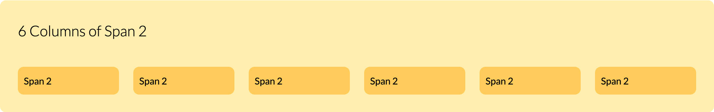

# Griddy
A very lightweight grid system based on CSS Grid that doesn't require 100s of column classes.

Griddy doesn't have predefined column classes like Bootstrap e.g `.col-md-1`,
`.col-md-6`, `.col-md-12` etc. Griddy provides the very basic grid structure
and you've to define the width for each element yourself.

Now the question arises why would you want to use a grid system that doesn't
provide you with predefined classes which is generally the reason for a grid
system? Well, All those frontend toolkits come with loads of features and
components that you don't need. You install huge packages and generate CSS
that you don't use. Thus you sacrifice performance for faster development
by generating unnecessary CSS. In software development performance is
more important than how fast you develop a website or an app. However
likewise Bootstrap with Griddy you can still develop relatively fast but you've
to write most of the styles yourself.

The reason why you would want to use a grid system like Griddy is that it gives
you more control over your UI layouts and lets you decide how much CSS you want
to generate. See the example below on how would that work!

### Example
For example you have two `div` elements with classes `.left-half` and
`.right-half` and you want them both to have equal width.

Your HTML code would look as follows:
```html
<div class="container">
    <div class="row">
        <div class="left-half"></div>
        <div class="right-half"></div>
    </div>
</div>
```

... and your SCSS code:
```scss
.left-half {
    grid-column: span 6;

    // This will add your media query for tablet portrait view
    @include respond(tab-port) {
        grid-column: span 12;
    }
}

.right-half {
    grid-column: span 6;
    
    // This will add your media query for tablet portrait view
    @include respond(tab-port) {
        grid-column: span 12;
    }
}
```

As you can see above instead of generating useless CSS classes with names
like `.col-md-1 ... .col-md-12` just with few lines of SCSS code we saved us
time and didn't compromise performance.

>**Note:** You can do this with Bootstrap as well but if you're only using it for
the grid then why would you want to install the whole package with
features and components you don't want?

## How to get Griddy?

You only need two SCSS files to add to your project. One is `_grid.scss`
which will generate the grid and the second file is `_mixins.scss`
which holds a mixin for media queries. If you're using ["the 7-1 pattern"](https://sass-guidelin.es/#the-7-1-pattern) from
SASS guidelines then you would put the `_grid.scss` in `layout/` directory and
mixins you would put inside `abstracts/` directory.

Below you'll see the code for `_grid.scss` and  `_mixins.scss` files:

## Code from `_mixins.scss`
```scss
@mixin respond($breakpoint) {
    @if $breakpoint == phone {
        @media only screen and (max-width: 540px) { @content };
    }

    @if $breakpoint == tab-port {
        @media only screen and (max-width: 720px) { @content };
    }

    @if $breakpoint == tab-land {
        @media only screen and (max-width: 960px) { @content };
    }

    @if $breakpoint == desktop {
        @media only screen and (max-width: 1140px) { @content };
    }
    
    @if $breakpoint == big-desktop {
        @media only screen and (max-width: 1320px) { @content };
    }
}
```

>**Note:**  You can merge the mixin with your `_mixins.scss` file it doesn't
have to be added as a separate file.

## Code from `_grid.scss`

The following code is for "Desktop First Design" approach. If you want to take
the "Mobile First Design" approach then in the `layout/` directory
there is a file called `_mobile-first-grid.scss` you can use that after you
rename it to `_grid.scss`. Likewise there is a mixin file called
`_mobile-first-mixins.scss` inside `abstracts/` directory.

```scss
// Desktop First

$grid__bp-xs: 0;
$grid__bp-sm: 576px;
$grid__bp-md: 768px;
$grid__bp-lg: 992px;
$grid__bp-xl: 1200px;
$grid__bp-xxl: 1400px;

$big-page-width: $grid__bp-xl;
$max-page-width: $grid__bp-xxl;
$grid-columns: 12;
$grid-gutter: 1.5em;

.container {
    max-width: $big-page-width;
    margin: 0 auto;
}

.row {
    display: grid;
    grid-template-columns: repeat($grid-columns, 1fr);
    grid-gap: $grid-gutter;
}

// Breakpoints
$map-grid-props: (
    '': 0,
    '-xxl': $grid__bp-xxl,
    '-xl': $grid__bp-xl,
    '-lg': $grid__bp-lg,
    '-md': $grid__bp-md,
    '-sm': $grid__bp-sm
);

// Max-widths for breakpoints
$container-max-widths: (
    '-xxl': 1320px,
    '-xl': 1140px,
    '-lg': 960px,
    '-md': 720px,
    '-sm': 540px
);

// Build the Grid
// Mixin for creating dynamic media queries
@mixin create-media-queries($breakpoint) {
    @if ($breakpoint == 0) {
        @content;
    } @else {
        @media only screen and (max-width: $breakpoint) {
            @content;
        }
    }
}

@mixin create-col-classes($modifier, $grid-columns, $breakpoint) {
    @include create-media-queries($breakpoint) {
        
        .container#{$modifier}, .container {
            // Gets the right max-width for the the right breakpoint
            max-width: map-get($container-max-widths, $modifier);
        }
        
    }
}

// Loops through breakpoints and creates all necessary classes for the right breakpoint
@each $modifier, $breakpoint in $map-grid-props {
    @include create-col-classes($modifier, $grid-columns, $breakpoint);
}
```

## How to use Griddy?

The HTML structure is almost the same as Bootstrap as seen in the example below.

### HTML
```html
<section class="section">
    <div class="container">
        <div class="row">
            <!-- You can name your columns as you wish -->
            <div class="column-1"></div>
            <div class="column-2"></div>
        </div>
    </div>
</section>
```

### SCSS
```scss
// .container and .row are already generated by the _grid.scss
// We only have to style the columns
.column-1 {
    grid-column: span 4;

    // This will add your media query for tablet portrait view
    @include respond(tab-port) {
        grid-column: span 6;
    }

    // This will add your media query for mobile view
    @include respond(phone) {
        grid-column: span 12;
    }
}

.column-2 {
    grid-column: span 8;
    
    // This will add your media query for tablet portrait view
    @include respond(tab-port) {
        grid-column: span 6;
    }
    
    // This will add your media query for mobile view
    @include respond(phone) {
        grid-column: span 12;
    }
}
```

## A General Overview of the Grid:

### Styles for the Whole Overview
```scss
.overview {
    margin-top: 6rem;

    &__title {
        margin-bottom: 4rem;
    }

    &__columns-container {
        padding: 3rem;
        border-radius: 1rem;
        background-color: $color-tertiary-light;
        margin-bottom: 4rem;
    }
}

.col {
    padding: 1rem;
    border-radius: 1rem;
    background-color: $color-tertiary-dark;
}

.col-span-1 { grid-column: span 1; }
.col-span-2 { grid-column: span 2; }
.col-span-3 { grid-column: span 3; }
.col-span-4 { grid-column: span 4; }
.col-span-6 { grid-column: span 6; }
.col-span-8 { grid-column: span 8; }
.col-span-12 { grid-column: span 12; }
```

### 12 Columns of Span 1

```html
<div class="overview__columns-container">
    <h3 class="overview__title">12 Columns of Span 1</h3>
    <div class="row">
        <div class="col col-span-1">Span 1</div>
        <div class="col col-span-1">Span 1</div>
        <div class="col col-span-1">Span 1</div>
        <div class="col col-span-1">Span 1</div>
        <div class="col col-span-1">Span 1</div>
        <div class="col col-span-1">Span 1</div>
        <div class="col col-span-1">Span 1</div>
        <div class="col col-span-1">Span 1</div>
        <div class="col col-span-1">Span 1</div>
        <div class="col col-span-1">Span 1</div>
        <div class="col col-span-1">Span 1</div>
        <div class="col col-span-1">Span 1</div>
    </div>
</div>
```


### 6 Columns of Span 2

```html
<div class="overview__columns-container">
    <h3 class="overview__title">6 Columns of Span 2</h3>
    <div class="row">
        <div class="col col-span-2">Span 2</div>
        <div class="col col-span-2">Span 2</div>
        <div class="col col-span-2">Span 2</div>
        <div class="col col-span-2">Span 2</div>
        <div class="col col-span-2">Span 2</div>
        <div class="col col-span-2">Span 2</div>
    </div>
</div>
```



### 4 Columns of Span 3

```html
<div class="overview__columns-container">
    <h3 class="overview__title">4 Columns of Span 3</h3>
    <div class="row">
        <div class="col col-span-3">Span 3</div>
        <div class="col col-span-3">Span 3</div>
        <div class="col col-span-3">Span 3</div>
        <div class="col col-span-3">Span 3</div>
    </div>
</div>
```


### 3 Columns of Span 4

```html
<div class="overview__columns-container">
    <h3 class="overview__title">3 Columns of Span 4</h3>
    <div class="row">
        <div class="col col-span-4">Span 4</div>
        <div class="col col-span-4">Span 4</div>
        <div class="col col-span-4">Span 4</div>
    </div>
</div>
```


### 2 Columns of Span 6

```html
<div class="overview__columns-container">
    <h3 class="overview__title">2 Columns of Span 6</h3>
    <div class="row">
        <div class="col col-span-6">Span 6</div>
        <div class="col col-span-6">Span 6</div>
    </div>
</div>
```


### 1 Column of Span 12

```html
<div class="overview__columns-container">
    <h3 class="overview__title">1 Column of Span 12</h3>
    <div class="row">
        <div class="col col-span-12">Span 12</div>
    </div>
</div>
```


### Mix Columns

```html
<div class="overview__columns-container">
    <h3 class="overview__title">Mix Columns</h3>
    <div class="row">
        <div class="col col-span-4">Span 4</div>
        <div class="col col-span-2">Span 2</div>
        <div class="col col-span-6">Span 6</div>
        <div class="col col-span-2">Span 2</div>
        <div class="col col-span-8">Span 8</div>
        <div class="col col-span-2">Span 2</div>
        <div class="col col-span-6">Span 6</div>
        <div class="col col-span-3">Span 3</div>
        <div class="col col-span-3">Span 3</div>
        <div class="col col-span-8">Span 8</div>
        <div class="col col-span-4">Span 4</div>
        <div class="col col-span-12">Span 12</div>
    </div>
</div>
```


